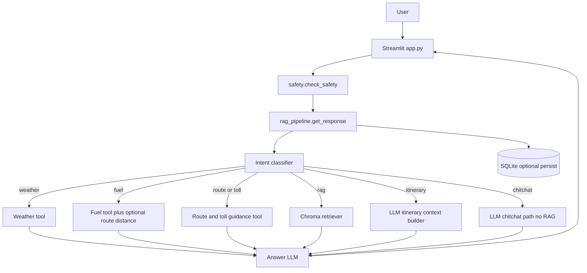
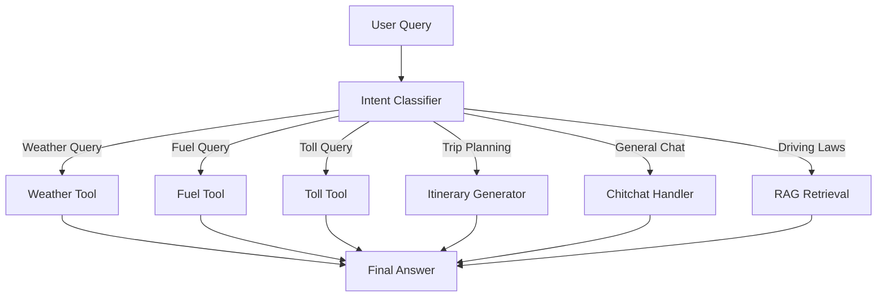

# Euro Road Trip Advisor

A **Streamlit** web app: an AI assistant for **European road trips**, combining **RAG** (Chroma + OpenAI embeddings), **intent-based routing**, and **tools** for weather, route distance/duration, approximate toll guidance, and fuel estimates. Optional **signup/login**, **SQLite persistence**, and **route + map** visualization (Folium).

---

## Features

- **Chat UI**: Ask about routes, tolls, fuel, weather, driving rules, or short itineraries.
- **Sidebar**:
  - Optional **starting city** (fallback when chat doesn’t name both ends of a route).
  - **Traveler profile** and **trip style** (saved for logged-in users).
  - **Preferences** (e.g. avoid tolls, scenic vs highways).
  - **Token usage / estimated cost** for the last reply.
  - **Export** chat as JSON, CSV, or PDF.
- **Intent routing** (`rag_pipeline.py`): weather, fuel, toll, route, itinerary, chitchat, or RAG (driving-law knowledge base).
- **Tools** (`tools.py`):
  - **Weather** — OpenWeatherMap when `OPENWEATHER_API_KEY` is set; otherwise a simple simulated reply.
  - **Route + toll context** — **OpenRouteService** directions + **Nominatim** geocoding; approximate vignette/toll guidance from a catalog (`toll_catalog.py`, `toll_estimate.py`). **ORS API key required** for real routing.
  - **Fuel** — heuristic cost from distance (or distance taken from the route tool when you give two cities).
- **RAG**: Local **Chroma** store over `data/*.txt`, embeddings `text-embedding-3-small`.
- **Safety** (`safety.py`): keyword + OpenAI **moderation** on user input.
- **Persistence** (`db.py` + `app_state.sqlite3`): users (hashed passwords), conversations, preferences, geocode/route caches, **last route context** for follow-ups (“fuel for this trip”).
- **LangGraph (optional)**: SQLite checkpoint helper for best-effort session snapshots (not a full `StateGraph` workflow).
- **Tracing**: `langsmith` `@traceable` on the main pipeline (when `LANGCHAIN_*` env vars are set).

---

## Requirements

- **Python ≥ 3.13** (see [`pyproject.toml`](pyproject.toml))
- **OpenAI API key** (required for chat, RAG, routing)
- **OpenRouteService API key** (recommended for real routes/maps)
- **OpenWeather API key** (optional, for live weather)

---

## Installation

### 1. Clone and enter the project

```bash
git clone https://github.com/nehaai2302-prog/euro-roadtrip-advisor.git
cd project3
```

### 2. Install dependencies (recommended: **uv**)

```bash
uv sync
```

Or with pip from the project root (install [`pyproject.toml`](pyproject.toml) dependencies in your environment).

### 3. Environment variables

Create a **`.env`** file in the project root (it is **gitignored**):

```env
OPENAI_API_KEY=sk-...
# Recommended for routing + map
ORS_API_KEY=...
# Optional
OPENWEATHER_API_KEY=...
# Optional — LangSmith tracing
# LANGCHAIN_TRACING_V2=true
# LANGCHAIN_API_KEY=...
```

On **Streamlit Community Cloud**, use **Secrets** instead of `.env` for `OPENAI_API_KEY`, etc.

### 4. Build the vector store (RAG)

```bash
uv run python ingest.py
```

This creates / updates the **`chroma_db/`** directory from files under **`data/`**.

### 5. Run the app

```bash
uv run streamlit run app.py
```

Open the URL shown (default **http://localhost:8501**).

---

## Usage

1. **Guest mode** works immediately; **Sign in** to persist chat and preferences (when using the stock SQLite DB).
2. Optionally set **“Where are you starting from?”** in the sidebar as a default start city.
3. Ask questions, e.g.:
   - “Fastest route from Munich to Berlin”
   - “What are approximate tolls on that corridor?”
   - “Fuel cost for 400 km” or “Fuel cost for this trip” (after a route/itinerary established the corridor)
   - “Weather in Vienna tomorrow”
   - "Are there any special driving rules in Scandinavia?"
   - "Plan a scenic route from London to Edinburgh"
   - “Speed limits on German motorways” (RAG)

4. Expand **“System Logic”** under a reply to see tools and retrieved chunks.

---

## Project structure

```
project3/
├── app.py                 # Streamlit UI, auth panel, chat, exports, map
├── rag_pipeline.py   # Intents, RAG, tools orchestration, prompts
├── tools.py               # Weather, route+tolls, fuel, toll vignette tool
├── toll_estimate.py       # Country inference + toll catalog attach
├── toll_catalog.py        # Static per-country toll vignette hints
├── map_utils.py           # Folium map from polyline
├── ingest.py              # Chroma ingestion from data/
├── db.py                  # SQLite: users, chats, prefs, caches, last_route
├── auth.py                # Password hashing, registration, reset tokens
├── safety.py              # Safety + moderation gate
├── data/                  # Source text for RAG
├── chroma_db/             # Generated by ingest (usually not committed)
├── app_state.sqlite3      # Runtime DB (usually not committed)
├── pyproject.toml         # Dependencies + project metadata
├── uv.lock                # Lockfile (optional but recommended with uv)
└── README.md
```

---

## Architecture (overview)



## Intent Routing Logic



---

## Dependencies (high level)

Declared in [`pyproject.toml`](pyproject.toml), including:

- **streamlit** / **streamlit-folium** / **streamlit-authenticator**
- **langchain-***, **langchain-openai**, **langchain-chroma**
- **langgraph** (checkpoint utilities)
- **flexpolyline** (map encoding)
- **python-dotenv**

Exact versions are pinned in **`uv.lock`** when using `uv sync`.

---

## Deployment notes (GitHub / Streamlit Cloud)

- **Do not commit** `.env`, `__pycache__/`, or `.streamlit/secrets.toml`.
- **`chroma_db/`** and **`app_state.sqlite3`** are **generated locally**. For Streamlit Cloud you typically either:
  - **Commit `chroma_db/`** if size is acceptable (or use Git LFS), **or**
  - Run **`ingest.py` once** in CI or on first deploy (watch build time and memory limits).
- **`app_state.sqlite3`** on cloud hosting is often **ephemeral** unless you add external storage; **`init_db()`** still creates empty tables on first run.

---

## Configuration & troubleshooting

| Issue | What to check |
|--------|----------------|
| Missing API key | `.env` or Streamlit Secrets: `OPENAI_API_KEY` |
| Routing / map errors | `ORS_API_KEY`, rate limits, city spelling |
| RAG empty or errors | Run `ingest.py`; ensure `chroma_db` exists; check `data/` |
| Weather looks fake | Set `OPENWEATHER_API_KEY` |
| Lint / import errors | Python **3.13+**, `uv sync` |

---

## Models (current defaults)

- **Chat / routing**: `gpt-4o-mini` with rate limiting and retries (`rag_pipeline.py`).
- **Embeddings**: `text-embedding-3-small`.

Change models in **`rag_pipeline.py`** if needed.

---

## License

Educational / portfolio use. Respect **OpenAI**, **OpenStreetMap / Nominatim**, **OpenRouteService**, and **OpenWeather** terms of use.

---

## Possible next steps

- Hosted PostgreSQL (e.g. **Supabase**) instead of SQLite for durable multi-user deploys.
- **`pgvector`** or hosted vector DB if you outgrow file-based Chroma on ephemeral disks.
- Traffic-aware ETAs (separate API integration).
